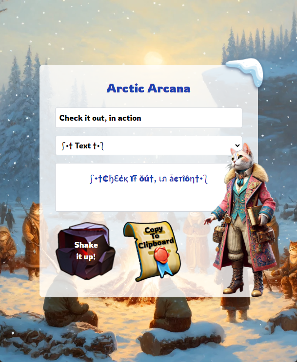

# Directory Structure for Excluded folders: public, node_modules, build, .gitnExcluded files: appsettings.json, appsettings.Development.json, file-preview.png, package-lock.jsonnn# n# n# n## 
nimport React from "react"

const Card = React.forwardRef(({ className, ...props }, ref) => (
  

))
Card.displayName = "Card"

const CardHeader = React.forwardRef(({ className, ...props }, ref) => (
  

))
CardHeader.displayName = "CardHeader"

const CardTitle = React.forwardRef(({ className, ...props }, ref) => (
  <h3
    ref={ref}
    className={`text-2xl font-semibold leading-none tracking-tight ${className}`}
    {...props}
  />
))
CardTitle.displayName = "CardTitle"

const CardDescription = React.forwardRef(({ className, ...props }, ref) => (
  

))
CardDescription.displayName = "CardDescription"

const CardContent = React.forwardRef(({ className, ...props }, ref) => (
  

))
CardContent.displayName = "CardContent"

const CardFooter = React.forwardRef(({ className, ...props }, ref) => (
  

))
CardFooter.displayName = "CardFooter"

export { Card, CardHeader, CardFooter, CardTitle, CardDescription, CardContent }n
nn## 
n.App {
  text-align: center;
}

.App-logo {
  height: 40vmin;
  pointer-events: none;
}

@media (prefers-reduced-motion: no-preference) {
  .App-logo {
    animation: App-logo-spin infinite 20s linear;
  }
}

.App-header {
  background-color: #282c34;
  min-height: 100vh;
  display: flex;
  flex-direction: column;
  align-items: center;
  justify-content: center;
  font-size: calc(10px + 2vmin);
  color: white;
}

.App-link {
  color: #61dafb;
}

@keyframes App-logo-spin {
  from {
    transform: rotate(0deg);
  }
  to {
    transform: rotate(360deg);
  }
}
n
nn## 
nimport React from 'react';
import StyleTextGenerator from './MainContainer';

function App() {
  return (
    

      <StyleTextGenerator />
    

  );
}

export default App;n
nn## 
nimport { render, screen } from '@testing-library/react';
import App from './App';

test('renders learn react link', () => {
  render(<App />);
  const linkElement = screen.getByText(/learn react/i);
  expect(linkElement).toBeInTheDocument();
});
n
nn## 
nimport React, { useState, useCallback, useMemo } from 'react';
import { motion } from 'framer-motion';

const Arcana = () => {
  const [input, setInput] = useState('');
  const [selectedDecoration, setSelectedDecoration] = useState('');
  const [copied, setCopied] = useState(false);
  const [seed, setSeed] = useState(() => Math.random());
  const [isShaking, setIsShaking] = useState(false);

  const decorations = useMemo(() => [
    { open: "༺═•", close: "•═༻" },
    { open: "⧼✵", close: "✵⧽" },
    { open: "𓆣༒", close: "༒𓆣" },
    { open: "⟪⟬⚔", close: "⚔⟪⟬" },
    { open: "✧☾", close: "☽✧" },
    { open: "⎋❖", close: "❖⎋" },
    { open: "╰❀✶", close: "✶❀╯" },
    { open: "⫷☬", close: "☬⫸" },
    { open: "✸⌬", close: "⌬✸" },
    { open: "⊶⊶✾", close: "✾⊷⊷" },
    { open: "➵➵✦", close: "✦➵➵" },
    { open: "⍟⍟", close: "⍟⍟" },
    { open: "༶☽⚚", close: "⚚☾༶" },
    { open: "⟅•⟆", close: "⟅•⟆" },
    { open: "➷❃", close: "❃➷" },
    { open: "⊂⊂⦿", close: "⦿⊃⊃" },
    { open: "⚘⩫", close: "⩫⚘" },
    { open: "⌘༆", close: "༆⌘" },
    { open: "⊸⊸✹", close: "✹⊸⊸" },
    { open: "➶➶⚜", close: "⚜➶➶" },
    { open: "⫍❄", close: "❄⫎" },
    { open: "⊷⊷◈", close: "◈⊶⊶" },
    { open: "╭✪", close: "✪╮" },
    { open: "⛤⌑", close: "⌑⛤" },
    { open: "⩥⩤❧", close: "❧⩥⩤" },
    { open: "⫷⟆✿", close: "✿⟅⫸" },
    { open: "⟴༄", close: "༄⟴" },
    { open: "╰⌘", close: "⌘╯" },
    { open: "⊱⫸", close: "⫷⊰" },
    { open: "⊶⊶⚝", close: "⚝⊷⊷" },
    { open: "⌯•", close: "•⌯" },
    { open: "⧼⚔", close: "⚔⧽" },
    { open: "༄ༀ", close: "ༀ༄" },
    { open: "╰❂", close: "❂╯" },
    { open: "➳༶", close: "༶➳" },
    { open: "𓆏⌬", close: "⌬𓆏" },
    { open: "⩧✦", close: "✦⩧" },
    { open: "➳❂", close: "❂➳" },
    { open: "✦⌘", close: "⌘✦" },
    { open: "⚛❂", close: "❂⚛" },
    { open: "⚔⦿", close: "⦿⚔" },
    { open: "༼ʘ̚ل͜ʘ̚༽⊰", close: "⊱༼ʘ̚ل͜ʘ̚༽" },
    { open: "༼ つ ◕_◕ ༽つ", close: "༼ つ ◕_◕ ༽つ" },
    { open: "(ﾉ◕ヮ◕)ﾉ*:･ﾟ✧", close: "✧ﾟ･: *ヽ(◕ヮ◕ヽ)" },
    { open: "乁( •_• )ㄏ", close: "ㄏ( •_• )乁" },
    { open: "ᕙ(⇀‸↼‶)ᕗ", close: "ᕙ(⇀‸↼‶)ᕗ" },
    { open: "(ง ͠° ͟ل͜ ͡°)ง", close: "(ง ͠° ͟ل͜ ͡°)ง" },
    { open: "(¬‿¬)", close: "(¬‿¬)" },
    { open: "╚(•⌂•)╝", close: "╚(•⌂•)╝" },
    { open: "┬┴┬┴┤(･_├┬┴┬┴", close: "┬┴┬┴┤(･_├┬┴┬┴" },
    { open: "(ʘ‿ʘ)", close: "(ʘ‿ʘ)" },
    { open: "⊂(◉‿◉)つ", close: "⊂(◉‿◉)つ" },
    { open: "( ͡° ͜ʖ ͡°)", close: "( ͡° ͜ʖ ͡°)" },
    { open: "(▀̿Ĺ̯▀̿ ̿)", close: "(▀̿Ĺ̯▀̿ ̿)" },
    { open: "(งಠ_ಠ)ง", close: "(งಠ_ಠ)ง" },
    { open: "ლ(ಠ益ಠ)ლ", close: "ლ(ಠ益ಠ)ლ" },
    { open: "༼ ºل͟º ༽", close: "༼ ºل͟º ༽" },
    { open: "༼ຈل͜ຈ༽", close: "༼ຈل͜ຈ༽" },
    { open: "ψ(｀∇´)ψ", close: "ψ(｀∇´)ψ" },
    { open: "(¬_¬)", close: "(¬_¬)" },
    { open: "ᕦ(ò_óˇ)ᕤ", close: "ᕦ(ò_óˇ)ᕤ" },
    { open: "⊂(・﹏・⊂)", close: "(つ´ω`)つ" },
    { open: "༼ つ ಥ_ಥ ༽つ", close: "༼ つ ಥ_ಥ ༽つ" },
    { open: "(ﾉಥ益ಥ）ﾉ", close: "ヽ(ಥ益ಥﾉ)" },
    { open: "(ノ°Д°）ノ︵", close: "︵(ノ°Д°）ノ" },
    { open: "(｡♥‿♥｡)", close: "(｡♥‿♥｡)" },
    { open: "✌(◕‿-)✌", close: "✌(-‿◕)✌" },
    { open: "(ಥ﹏ಥ)", close: "(ಥ﹏ಥ)" },
    { open: "ಠ_ಠ", close: "ಠ_ಠ" },
    { open: "(ʘᴗʘ✿)", close: "(✿ʘ‿ʘ)" },
    { open: "(づ｡◕‿‿◕｡)づ", close: "(づ｡◕‿‿◕｡)づ" },
    { open: "⤜(ʘ_ʘ)⤏", close: "⤜(ʘ_ʘ)⤏" },
    { open: "(⊙_◎)", close: "(⊙_◎)" },
    { open: "◉_◉", close: "◉_◉" },
    { open: "╚»★«╝", close: "╚»★«╝" },
    { open: "⫷⫸༒༒", close: "༒༒⫷⫸" },
    { open: "➶➶❖", close: "❖➶➶" },
    { open: "༒༆••", close: "••༆༒" },
    { open: "═══『", close: "』═══" },
    { open: "⸻⸻❁", close: "❁⸻⸻" },
    { open: "↞↞✿", close: "✿↠↠" },
    { open: "⌘⚜", close: "⚜⌘" },
    { open: "➷➷◈", close: "◈➷➷" },
    { open: "༶⸙༶", close: "༶⸙༶" },
    { open: "⎯⎯❦", close: "❦⎯⎯" },
    { open: "༻༺❂", close: "❂༻༺" },
    { open: "༶☽◯", close: "◯☾༶" },
    { open: "╰☆☆", close: "☆☆╯" },
    { open: "⤞⤞༒", close: "༒⤝⤝" },
    { open: "⌜••✵", close: "✵••⌝" },
    { open: "╔═◢◤", close: "◢◤═╗" },
    { open: "⫷⫸••", close: "••⫷⫸" },
    { open: "༶⸙❃", close: "❃⸙༶" }
  ],[]);
  const styleMap = useMemo(() => ({
    "0": ["⓪", "0", "〇", "๐", "Ø", "੦", "߀", "⓿", "ʘ", "0", "⊘", "ø", "⁰", "ᴑ", "∅", "۰", "Օ", "𝟢", "⍥", "𝟬"],
    "1": ["①", "➀", "1", "１", "𝟏", "१", "۱", "𝟙", "①", "𝟣", "१", "١", "ℵ", "❶", "⓵", "𝟏", "𝟷", "۱", "𝟭", "Ⅰ"],
    "2": ["②", "➁", "2", "𝟐", "２", "२", "۲", "𝟚", "❷", "٢", "𝟤", "⓶", "۲", "２", "Ⅱ", "๒", "𝟮", "𝟸", "۲", "𝟤"],
    "3": ["③", "➂", "3", "𝟑", "३", "٣", "𝟛", "❸", "⓷", "３", "۳", "Ⅲ", "3", "٣", "𝟯", "𝟹", "ꝛ", "③", "𝟶", "ℨ"],
    "4": ["④", "➃", "4", "𝟒", "४", "٤", "𝟜", "❹", "٤", "𝟦", "⓸", "４", "Ⅳ", "۴", "४", "𝟰", "𝟸", "四", "𝟜", "ꝛ"],
    "5": ["⑤", "➄", "5", "𝟓", "५", "٥", "𝟝", "❺", "⓹", "٥", "۵", "𝟻", "Ⅴ", "٥", "𝟱", "𝟸", "５", "𝟓", "ꝙ", "Ƽ"],
    "6": ["⑥", "➅", "6", "𝟔", "६", "٦", "𝟞", "❻", "⓺", "٦", "۶", "𝟼", "Ⅵ", "६", "𝟨", "６", "６", "Ⅳ", "⍻", "Ƽ"],
    "7": ["⑦", "➆", "7", "𝟕", "७", "٧", "𝟟", "❼", "⓻", "٧", "𝟽", "７", "Ⅶ", "۷", "𝟭", "𝟭", "𝟠", "𐑅", "7", "𝟕"],
    "8": ["⑧", "➇", "8", "𝟖", "८", "٨", "𝟠", "❽", "⓼", "٨", "۸", "𝟾", "８", "Ⅷ", "۸", "𝟚", "๘", "౮", "𝟾", "⨀"],
    "9": ["⑨", "➈", "9", "𝟗", "९", "٩", "𝟡", "❾", "⓽", "९", "٩", "𝟿", "９", "Ⅸ", "۹", "𝟢", "⑩", "卍", "𝟗", "ꝙ"],
    "!": ["!", "！", "❗", "❕", "ǃ", "¡", "︕", "﹗", "！", "❢", "❣", "！", "︕", "ᵎ", "ǃ", "‼", "ǂ", "‽", "¡", "︕"],
    "@": ["@", "＠", "⍲", "ᴁ", "❨", "﷽", "⊗", "⓪", "＠", "⦿", "◉", "©", "𝛼", "٭", "₳", "ᴁ", "◯", "ʘ", "⍺", "Ⓐ"],
    "#": ["#", "＃", "❖", "⁂", "♯", "⌗", "⧠", "⌘", "⍈", "＃", "❧", "♯", "⨃", "₤", "⧟", "𝄢", "＃", "⨁", "𝄤", "⨀"],
    "$": ["$", "＄", "₪", "₡", "₣", "₥", "￠", "円", "₩", "₹", "₳", "₤", "＄", "₢", "₯", "₨", "₾", "৲", "₸", "₱"],
    "%": ["%", "％", "℅", "٪", "ℓ", "℀", "℁", "℅", "ℓ", "℀", "℁", "％", "٪", "ℓ", "‰", "ℇ", "⊕", "⊖", "⊗", "⊙"],
    "^": ["^", "＾", "ˆ", "⌒", "︿", "⨌", "◡", "∧", "∨", "⊻", "⊼", "⊽", "＾", "ˆ", "⊻", "⊺", "⋀", "⋁", "⋃", "⋂"],
    "&": ["&", "＆", "⦸", "⊕", "⊙", "⊗", "⊞", "⊟", "⦶", "⦷", "⦵", "＆", "⊡", "⊨", "⊭", "⦿", "⊜", "⊛", "⊰", "⊱"],
    "*": ["*", "＊", "⁕", "❋", "⭑", "⭒", "⛤", "✱", "✲", "✴", "＊", "✶", "✷", "✸", "✹", "✺", "✼", "❂", "❄", "✪"],
    "(": ["(", "（", "❨", "❪", "❬", "⦅", "⦇", "⦉", "⦋", "⦍", "⦏", "（", "❭", "❯", "⦙", "⦚", "⦛", "⦜", "⦮", "⦯"],
    ")": [")", "）", "❩", "❫", "❬", "⦆", "⦈", "⦊", "⦌", "⦎", "⦐", "❯", "❮", "❭", "❬", "❯", "⦕", "⦖", "⦗", "⦘"],
    "-": ["-", "−", "–", "⸗", "⸚", "–", "⸺", "⸻", "⸺", "⸻", "⎯", "−", "―", "─", "━", "➖", "⧀", "⧁", "⧂", "⧃"],
    "_": ["_", "＿", "‿", "︵", "︶", "︷", "︸", "︹", "︺", "︻", "︼", "︽", "︾", "︿", "﹀", "﹁", "﹂", "﹃", "﹄", "︾"],
    "=": ["=", "＝", "≠", "≡", "≢", "≣", "⧫", "≠", "⩵", "⩶", "⊥", "⊦", "⊧", "⊪", "⊫", "⊮", "⊯", "⊰", "⊱", "≌"],
    "+": ["+", "＋", "⊕", "⊖", "⊗", "⊞", "⊟", "⊠", "⊡", "⊣", "⊤", "⊥", "⊦", "⊧", "⊨", "⊭", "⊮", "⊯", "⊰", "⊱"],
    "a": ["α", "ค", "ค", "ᴀ", "₳", "å", "ą", "ä", "á", "∆", "α", "Ⱥ", "ª", "Æ", "ǡ", "Ǻ", "Ã", "ª", "ᗅ", "𝒶"],
    "b": ["ß", "฿", "乃", "в", "β", "ც", "Ɓ", "฿", "ɓ", "Ƅ", "β", "ʙ", "в", "ß", "ƀ", "ß", "Ь", "ʙ", "ϐ", "β"],
    "c": ["ς", "૮", "¢", "Ꮯ", "ȼ", "ς", "Ĉ", "₵", "ç", "ʗ", "Ⲥ", "𝒸", "ς", "¢", "ć", "Č", "ḉ", "ċ", "Ç", "č"],
    "d": ["đ", "∂", "ძ", "๔", "Ð", "ɖ", "ƌ", "D", "đ", "ḓ", "ɖ", "∂", "Ð", "Đ", "ԁ", "ḋ", "δ", "Ꮄ", "d", "ḑ"],
    "e": ["є", "ε", "Ɇ", "є", "乇", "ë", "Ɛ", "έ", "ē", "ξ", "ε", "£", "Ɛ", "ë", "∑", "ɇ", "℮", "ė", "ē", "ḗ"],
    "f": ["ƒ", "ғ", "Բ", "₣", "Բ", "f", "₣", "ʄ", "F", "ғ", "ḟ", "ғ", "ƒ", "Ƒ", "ʄ", "Բ", "Ғ", "ḟ", "Ŧ", "ϝ"],
    "g": ["ɠ", "g", "₲", "Ǥ", "Ɠ", "ĝ", "ğ", "ƃ", "₲", "ɢ", "g", "ǥ", "ḡ", "Ġ", "Ğ", "g", "ɢ", "ƃ", "Ǥ", "ℊ"],
    "h": ["ђ", "н", "ђ", "Һ", "н", "Ħ", "ђ", "ɦ", "ђ", "♄", "н", "h", "н", "ħ", "ђ", "н", "ḧ", "Ħ", "ʰ", "ɦ"],
    "i": ["เ", "ɨ", "ɪ", "เ", "เ", "ï", "í", "į", "î", "ΐ", "į", "ı", "ï", "î", "ỉ", "ἰ", "ỉ", "𝒾", "ι", "¡"],
    "j": ["נ", "ן", "ʝ", "נ", "ʆ", "ĵ", "ɉ", "Ј", "ʲ", "ʝ", "Ɉ", "ĵ", "ϳ", "ʝ", "ј", "ǰ", "ᴊ", "ј", "ĵ", "ʲ"],
    "k": ["к", "ƙ", "Қ", "ќ", "Ҡ", "κ", "Ƙ", "қ", "к", "ҟ", "Ҡ", "κ", "ќ", "ḳ", "ҟ", "қ", "κ", "ƙ", "𝓀", "ҡ"],
    "l": ["ℓ", "l", "ł", "ι", "Լ", "Ł", "Ꮮ", "ℓ", "l", "ɭ", "Ḷ", "ʟ", "ĺ", "Ŀ", "ℒ", "₤", "ḻ", "ł", "ļ", "ḽ"],
    "m": ["๓", "м", "ɱ", "๓", "爪", "ʍ", "м", "₥", "m", "ო", "Ꮇ", "ɱ", "м", "₥", "m", "ṃ", "ṁ", "ḿ", "m", "ϻ"],
    "n": ["ภ", "η", "ภ", "ก", "и", "ท", "η", "ղ", "п", "η", "ŋ", "ղ", "ภ", "η", "и", "ή", "ή", "ṅ", "ń", "Ň"],
    "o": ["๏", "๐", "σ", "о", "Ø", "ø", "õ", "ô", "ö", "θ", "ø", "ø", "ö", "σ", "ờ", "ọ", "ѻ", "ѳ", "Ò", "ŏ"],
    "p": ["ρ", "ק", "ק", "þ", "ק", "P", "Ƥ", "ƥ", "þ", "թ", "ρ", "ק", "p", "ṕ", "ṗ", "p", "ῤ", "ρ", "Ƥ", "ƿ"],
    "q": ["q", "φ", "Q", "զ", "Ω", "Ҩ", "q", "ʠ", "Ɋ", "ℚ", "q", "զ", "ϙ", "q", "զ", "ǫ", "ʠ", "Q", "ǭ", "Q"],
    "r": ["г", "г", "я", "Ř", "₹", "я", "r", "ѓ", "ř", "ʀ", "r", "Я", "г", "ŗ", "ř", "r", "ȑ", "ŕ", "ṟ", "Ɍ"],
    "s": ["ร", "ѕ", "ş", "Ş", "ƨ", "§", "ʂ", "Š", "Ş", "Ƨ", "ş", "Š", "ṡ", "ș", "s", "š", "ѕ", "ş", "ṥ", "ʂ"],
    "t": ["t", "Շ", "Ƭ", "Ŧ", "†", "է", "ƭ", "₮", "t", "τ", "ŧ", "ƭ", "Ť", "ҭ", "ƫ", "т", "ṫ", "ț", "Ƭ", "т"],
    "u": ["ย", "µ", "υ", "Ʊ", "บ", "ú", "û", "ù", "ư", "น", "ú", "υ", "Ü", "ù", "ũ", "û", "ṳ", "ű", "ų", "ȗ"],
    "v": ["ש", "v", "ง", "ν", "ѵ", "v", "√", "ṽ", "v", "ν", "v", "ṽ", "v", "v", "v", "ṿ", "v", "v", "v", "v"],
    "w": ["ฬ", "ω", "Ɯ", "ώ", "щ", "Ψ", "ฬ", "ẅ", "ώ", "w", "ẁ", "ω", "ώ", "w", "ฬ", "щ", "ώ", "ẃ", "ẁ", "ω"],
    "x": ["א", "ж", "x", "ჯ", "×", "ẋ", "χ", "×", "Ӿ", "✗", "χ", "×", "ж", "ẋ", "ҳ", "×", "χ", "ẍ", "✗", "Ẋ"],
    "y": ["ץ", "ყ", "ϓ", "¥", "ү", "ÿ", "ý", "ÿ", "γ", "ч", "ყ", "ý", "ÿ", "ẙ", "γ", "ү", "ϒ", "ý", "ỷ", "ȳ"],
    "z": ["z", "ƶ", "ʑ", "ȥ", "z", "ž", "ʐ", "ź", "Ż", "ƶ", "ẓ", "ž", "ƶ", "ż", "Ž", "Ƶ", "Z", "Ź", "Z", "Ẕ"]
  }), []);

  const stylizeText = useCallback((text, currentSeed) => {
    return text.toLowerCase().split('').map((char, index) => {
      if (styleMap[char]) {
        const styleIndex = Math.floor((currentSeed * 1000 + index) % styleMap[char].length);
        return styleMap[char][styleIndex];
      }
      return char;
    }).join('');
  }, [styleMap]);

  const output = useMemo(() => stylizeText(input, seed), [input, seed, stylizeText]);

  const decoratedOutput = useMemo(() => {
    const decoration = selectedDecoration 
      ? decorations.find(d => d.open === selectedDecoration)
      : { open: '', close: '' };
    return `${decoration.open}${output}${decoration.close}`;
  }, [output, selectedDecoration, decorations]);

  const handleInputChange = useCallback((e) => {
    setInput(e.target.value);
  }, []);

  const handleDecorationChange = useCallback((e) => {
    setSelectedDecoration(e.target.value);
  }, []);

  const handleCopy = useCallback(() => {
    navigator.clipboard.writeText(decoratedOutput).then(() => {
      setCopied(true);
      setTimeout(() => setCopied(false), 2000);
    });
  }, [decoratedOutput]);

  const handleShakeItUp = useCallback(() => {
    setSeed(Math.random());
    setIsShaking(true);
  
    const element = document.querySelector('.shakeable');
    element.classList.add('shake-animation');
    setTimeout(() => {
      element.classList.remove('shake-animation');
      setIsShaking(false);
    }, 500);
  }, []);

  return (
    

      

        <input
          type="text"
          placeholder="Enter your text here"
          value={input}
          onChange={handleInputChange}
          className="w-full p-2 border border-gray-300 rounded"
        />
      

      

        <select
          onChange={handleDecorationChange}
          value={selectedDecoration}
          className="w-full p-2 border border-gray-300 rounded"
        >
          <option value="">Select a decoration</option>
          {decorations.map((decoration, index) => (
            <option key={index} value={decoration.open}>
              {decoration.open} Text {decoration.close}
            </option>
          ))}
        </select>
      

      

        

          {decoratedOutput}
        

      

      

        <motion.div
          onClick={handleShakeItUp}
          className={`relative w-20 h-20 sm:w-24 sm:h-24 cursor-pointer shakeable ${isShaking ? 'glow-fire' : ''}`}
          style={{
            backgroundImage: `url(${process.env.PUBLIC_URL}/images/FireCrystal.png)`,
            backgroundSize: 'cover',
            backgroundPosition: 'center',
            opacity: isShaking ? 0.8 : 1
          }}
          whileHover={{ scale: 1.05 }}
          whileTap={{ scale: 0.95 }}
        >
          
            <>Shake  it up!</>
          
        </motion.div>
        <motion.div 
          onClick={handleCopy} 
          className={`relative w-20 h-20 sm:w-24 sm:h-24 cursor-pointer flex items-center justify-center ${copied ? 'animate-pulseShrinkGrow' : ''}`} 
          style={{ 
            backgroundImage: `url(${process.env.PUBLIC_URL}/images/CopyToClipboard.png)`, 
            backgroundSize: 'cover', 
            backgroundPosition: 'center' 
          }}
          whileHover={{ scale: 1.05 }}
          whileTap={{ scale: 0.95 }}
        >
          
            {copied ? 'Copied!' : <>Copy To Clipboard</>}
          
        </motion.div>
      

    

  );
};

export default Arcana;n
nn## 
nimport React, { useState } from 'react';

// Map hero types to their gradient colors
const heroTypeGradient = {
  Jeronimo: 'from-orange-600 to-orange-400',
  Molly: 'from-purple-600 to-purple-400',
  Bahiti: 'from-purple-600 to-purple-400',
  Natalia: 'from-orange-600 to-orange-400',
  Jessie: 'from-purple-600 to-purple-400',
  Jasser: 'from-purple-600 to-purple-400',
  'Seo-yoon': 'from-purple-600 to-purple-400',
  // Add other heroes and their types as needed
};

const HeroImage = ({ name }) => (
  

    

    
      
    
    
    

      {name}
    

  

);

const CircleHeroImage = ({ name }) => (
  

    

      

        
      

    

    {name}
  

);

const TroopImage = ({ type }) => (
  
);

const Formation = ({ infantry, lancers, marksmen }) => (
  

    
Ideal Troop Formation Ratio:

    

      

        Infantry
        <TroopImage type="Infantry" />
        {infantry}%
      

      

        Lancer
        <TroopImage type="Lancer" />
        {lancers}%
      

      

        Marksman
        <TroopImage type="Marksman" />
        {marksmen}%
      

    

  

);

const HeroList = ({ heroes }) => (
  

    {heroes.map(hero => <HeroImage key={hero.name} name={hero.name} />)}
  

);

const CircleHeroList = ({ heroes }) => (
  

    {heroes.map(hero => <CircleHeroImage key={hero.name} name={hero.name} />)}
  

);

const BearHunt = () => {
  const [activeTab, setActiveTab] = useState('joining'); // State to handle active tab

  return (
    
     
      {/* Tabs for Switching between Joining a Rally and Starting a Rally */}
      

        <button
          onClick={() => setActiveTab('joining')}
          className={`px-4 py-2 rounded-t-lg ${activeTab === 'joining' ? 'bg-blue-200' : 'bg-gray-200'}`}
        >
          Joining a Rally
        </button>
        <button
          onClick={() => setActiveTab('starting')}
          className={`px-4 py-2 rounded-t-lg ${activeTab === 'starting' ? 'bg-blue-200' : 'bg-gray-200'}`}
        >
          Starting a Rally
        </button>
      

  
      {/* Content based on selected tab */}
      {activeTab === 'joining' ? (
        <section className="mb-6 bg-blue-50 p-3 rounded-lg shadow">
          

            

              +
            

            <h3 className="text-sm font-semibold text-gray-700">Joining A Rally: Hero Setup</h3>
          

          

            
These heroes go on the left!

            <CircleHeroList heroes={[
              { name: 'Jessie' },
              { name: 'Jasser' },
              { name: 'Jeronimo' },
              { name: 'Seo-yoon' }
            ]} />
            

              

                These heroes greatly increase the damage done in the rally if joining with them positioned all the way on the left.
                Jessie, Jasser and Jeronimo are standards for every situation where you want to increase your Lethality, 
                which is the best source of damage for bear trap. Seo-yoon is boosting your Attack stat, 
                which is the second source of damage for bear trap.
              

            

          

        </section>
      ) : (
        <section className="mb-6 bg-green-50 p-3 rounded-lg shadow">
          {/* Rally Captain Setup 1 */}
          

            

              Rally Captain Setup 1
              
            

          

          {/* Hero portraits */}
          

            <HeroList heroes={[
              { name: 'Jeronimo' },
              { name: 'Molly' },
              { name: 'Bahiti' }
            ]} />
          

          {/* Blue well with custom text */}
          

            In most cases, you will have the best stats on Infantry due to Jeronimo’s raw stats. Using equal formation with slightly more marksmen troops works the best.
          

          {/* Troop formation section */}
          <Formation infantry={30} lancers={30} marksmen={40} />
  
          {/* Rally Captain Setup 2 */}
          <section className="mb-6 bg-blue-50 p-3 rounded-lg shadow">
            

              

                Rally Captain Setup 2
                
              

            

            {/* Hero portraits */}
            

              <HeroList heroes={[
                { name: 'Natalia' },
                { name: 'Molly' },
                { name: 'Bahiti' }
              ]} />
            

            {/* Blue well with custom text for setup 2 */}
            

              This configuration is best for anyone that does not have Jeronimo, or for anyone who wants to use Jeronimo for joining rallies!
            

            {/* Troop formation section */}
            <Formation infantry={20} lancers={40} marksmen={40} />
          </section>
        </section>
      )}
    

  );
};

export default BearHunt;
n
nn## 
nimport React, { useState } from 'react';

// Define hero gradients and troop images
const heroTypeGradient = {
  Patrick: 'from-purple-600 to-purple-400',
};

const HeroImage = ({ name }) => (
  

    
    

      {name}
    

  

);

const TroopImage = ({ type }) => (
  
);

const CrazyJoe = () => {
  const [activeTab, setActiveTab] = useState('gainingPoints'); // Default to 'Gaining Points' tab

  return (
    

      {/* Tabs for Switching between sections */}
      

        <button
          onClick={() => setActiveTab('gainingPoints')}
          className={`px-4 py-2 rounded-t-lg ${activeTab === 'gainingPoints' ? 'bg-blue-200' : 'bg-gray-200'}`}
        >
          Gaining Points
        </button>
        <button
          onClick={() => setActiveTab('troopExchange')}
          className={`px-4 py-2 rounded-t-lg ${activeTab === 'troopExchange' ? 'bg-blue-200' : 'bg-gray-200'}`}
        >
          Troop Exchange
        </button>
        <button
          onClick={() => setActiveTab('specialWaves')}
          className={`px-4 py-2 rounded-t-lg ${activeTab === 'specialWaves' ? 'bg-blue-200' : 'bg-gray-200'}`}
        >
          Special Waves
        </button>
      

      {/* Content based on selected tab */}
      {activeTab === 'gainingPoints' && (
        <section className="mb-6 bg-yellow-50 p-3 rounded-lg shadow">
          <h3 className="text-lg font-semibold mb-2">Gaining Points</h3>
          

            <strong>City Defense Points:</strong> These points are only for the owner of the attacked city. They are double the points that can be achieved by killing troops.
          

          

            <strong>Kill Points:</strong> You get points for killing Crazy Joe's troops in every attack wave. The maximum City Defense Points is double the maximum Kill Points you can achieve per wave.
          

          

            

              On wave 7, 14, and 17, only online members will be attacked. On wave 10 & 20, the bandit will target the Alliance HQ. Make the strongest player the rally leader!
              When defending, killing &gt;50% of enemy troops is a successful defense. Be sure to check who Joe's troops are targeting.
            

          

        </section>
      )}

      {activeTab === 'troopExchange' && (
        <section className="mb-6 bg-red-50 p-3 rounded-lg shadow">
          <h3 className="text-lg font-semibold mb-2">Troop Exchange</h3>
          

            To maximize the points you get, use the "Zero Defense" strategy. This doesn't mean you aren't defending against Crazy Joe, but that you aren't defending your own city. Your city is fully defended by your alliance members. Your goal is:
          

          <ul className="list-disc pl-5">
            <li>Send out all your troops to other players!</li>
            <li>Reinforce players with little reinforcements to make the most kills!</li>
            <li>Don't send out your strongest heroes—they need to stay on the wall of your city!</li>
          </ul>
          

            Strategy:
            <ul className="list-disc pl-5">
              <li>Keep Strongest Heroes on your wall.</li>
              <li>Reinforce the strongest players or those close to losing.</li>
            </ul>
          

        </section>
      )}

      {activeTab === 'specialWaves' && (
        <section className="mb-6 bg-purple-50 p-3 rounded-lg shadow">
          <h3 className="text-lg font-semibold mb-2">Special Waves</h3>
          

  

    <HeroImage name="Patrick" />
  

  
  

    
    When sending troops to the Alliance HQ, Use Patrick as the leading hero!
  

          

            In waves 10 and 20, Crazy Joe will attack the Tundra Alliance Headquarters. During these waves, send troops to the headquarters to score points. Highest level troops should be sent by those with the most powerful troops to give the best chance at defending.
          

          

            

              Infantry
              <TroopImage type="Infantry" />
              60%
            

            

              Lancer
              <TroopImage type="Lancer" />
              20%
            

            

              Marksman
              <TroopImage type="Marksman" />
              20%
            

          

          
          

          Send more infantry than lancers or marksmen to score more points. Heal your troops after each wave. If you lose the event after two defeats, reinforce your allies!
          

        </section>
      )}
    

  );
};

export default CrazyJoe;
n
nn## 
nimport React, { useState } from 'react';

// Component for displaying troop images
const TroopImage = ({ type }) => (
  
);

const FrostfireMine = () => {
  const [activeTab, setActiveTab] = useState('introduction'); // Default to 'Introduction' tab

  return (
    

      {/* Tabs for Switching between sections */}
      

        <button
          onClick={() => setActiveTab('introduction')}
          className={`px-4 py-2 rounded-t-lg ${activeTab === 'introduction' ? 'bg-blue-200' : 'bg-gray-200'}`}
        >
          Introduction
        </button>
        <button
          onClick={() => setActiveTab('skills')}
          className={`px-4 py-2 rounded-t-lg ${activeTab === 'skills' ? 'bg-blue-200' : 'bg-gray-200'}`}
        >
          Skills
        </button>
        <button
          onClick={() => setActiveTab('strategy')}
          className={`px-4 py-2 rounded-t-lg ${activeTab === 'strategy' ? 'bg-blue-200' : 'bg-gray-200'}`}
        >
          Strategy
        </button>
      

      {/* Content based on selected tab */}
      {activeTab === 'introduction' && (
        <section className="mb-6 bg-blue-50 p-3 rounded-lg shadow">
          <h3 className="text-lg font-semibold mb-2">Introduction</h3>
          

            In the Frostfire Mine event, the goal is to gather the highest amount of orichalcum. Focus on strategic gameplay to maximize your points.
          

          

            There are two main ways to gather orichalcum: by gathering veins in level 1-3 areas and by occupying the smelter. This guide will show how to maximize your points beyond gathering.
          

          

            <h3 className="text-lg font-semibold mb-2">Important Tips</h3>
            <ul className="list-disc pl-5">
              <li>Stay on the outskirts of the battlefield to find more patrol guards and avoid crowded areas.</li>
              <li>Use free advanced teleport to reposition strategically.</li>
              <li>Watch for veins occupied by other players to loot them when possible.</li>
              <li>During vein outbursts, allocate all your marches to veins and stop attacking guards.</li>
              <li>Continue killing patrol guards but reserve one march to occupy and recall from veins every minute.</li>
            </ul>
          

        </section>
      )}

      {activeTab === 'skills' && (
        <section className="mb-6 bg-yellow-50 p-3 rounded-lg shadow">
          <h3 className="text-lg font-semibold mb-2">Skills to Unlock</h3>
          

            Unlocking the right skills will be key to dominating Frostfire Mine.
          

          {/* Skill Tree Image */}
          

          
            {/*  */}
          

          {/* Skill Descriptions with Highlights */}
          

            <h4 className="font-semibold mb-2">1st Skill - Right Branch</h4>
            
Unlock this skill to get 1500 orichalcum for each patrol guard defeated.

            <h4 className="font-semibold mt-4 mb-2">2nd Skill - Right Branch</h4>
            
This skill increases your march speed by 25%. Keep defeating patrol guards!

            <h4 className="font-semibold mt-4 mb-2">3rd Skill - Left Branch</h4>
            
Once unlocked, you can gather 5000 orichalcum for each vein occupied. Use it once per minute.

            <h4 className="font-semibold mt-4 mb-2">4th Skill - Left Branch</h4>
            
This skill provides a 15% boost to gathering speed. Keep defeating patrol guards and use one march every minute to gather/recall in a vein.

            <h4 className="font-semibold mt-4 mb-2">5th Skill - Right Branch</h4>
            
Use this skill during vein outbursts to get a 66% gathering speed boost. Activate before sending troops and do not recall until the 5-minute timer is up.

          

        </section>
      )}

      {activeTab === 'strategy' && (
        <section className="mb-6 bg-red-50 p-3 rounded-lg shadow">
          <h3 className="text-lg font-semibold mb-2">Strategy</h3>
          

            Start by staying in the outskirts of the battlefield where fewer players are found. Focus on patrol guards as your main target early on and do not gather veins until you unlock the third skill.
          

          

            Once you've unlocked the 3rd skill, occupy veins every minute, recall your march, and continue defeating patrol guards. Use the event timer to track when the third skill becomes available.
          

          

            During vein outbursts, use the 5th skill and switch all your marches to veins for 5 minutes to maximize orichalcum gathering.
          

          

            <h4 className="font-semibold mb-2">Final Strategy Tips</h4>
            <ul className="list-disc pl-5">
              <li>Use teleportation to move between less crowded areas and kill more patrol guards.</li>
              <li>Activate the 3rd skill every minute by recalling your troops from veins.</li>
              <li>Use the 5th skill during vein outbursts and gather without recalling for 5 minutes.</li>
              <li>Keep an eye on occupied veins to loot from other players when possible.</li>
            </ul>
          

          {/* Troop Formation */}
          

            

              Infantry
               <TroopImage type="Infantry" />
              33%
            

            

              Lancer
              <TroopImage type="Lancer" />
              33%
            

            

              Marksman
              <TroopImage type="Marksman" />
              33%
            

          

          {/* Testimonials */}
          

            <h4 className="font-semibold mb-2">Success Stories</h4>
            
<strong>My furnace was level 24,</strong> but I ranked 1 in this event, beating level 30 players using this strategy.

            
<strong>Another level 28 player</strong> used this same strategy and outranked crystal furnace players!

          

        </section>
      )}
    

  );
};

export default FrostfireMine;
n
nn## 
n@tailwind base;
@tailwind components;
@tailwind utilities;
@keyframes fadeOut {
  0% {
    opacity: 1;
    transform: scale(1);
  }
  100% {
    opacity: 0;
    transform: scale(0.5);
  }
}

@keyframes fadeIn {
  0% {
    opacity: 0;
  }
  100% {
    opacity: 1;
  }
}

.fade-out {
  animation: fadeOut 500ms forwards;
  transform: scale(1); /* Ensure it's always set to scale(1) after animation */
  transform-origin: center center;
}

.fade-in {
  animation: fadeIn 250ms forwards;
  transform: scale(1); /* Ensure it's always set to scale(1) after animation */
  transform-origin: center center;
}

@keyframes shake {
  0% { transform: translate(1px, 1px) rotate(0deg); }
  10% { transform: translate(-1px, -2px) rotate(-1deg); }
  20% { transform: translate(-3px, 0px) rotate(1deg); }
  30% { transform: translate(3px, 2px) rotate(0deg); }
  40% { transform: translate(1px, -1px) rotate(1deg); }
  50% { transform: translate(-1px, 2px) rotate(-1deg); }
  60% { transform: translate(-3px, 1px) rotate(0deg); }
  70% { transform: translate(3px, 1px) rotate(-1deg); }
  80% { transform: translate(-1px, -1px) rotate(1deg); }
  90% { transform: translate(1px, 2px) rotate(0deg); }
  100% { transform: translate(1px, -2px) rotate(-1deg); }
}
/* Pulsing fire effect - subtle fire glow on image contours */
@keyframes pulseFire {
  0% {
    filter: drop-shadow(0 0 15px rgba(255, 69, 0, 0.6)) drop-shadow(0 0 30px rgba(61, 43, 62, 0.8)) drop-shadow(0 0 15px rgba(255, 0, 0, 0.9));
    opacity: 1;
  }
  50% {
    filter: drop-shadow(0 0 25px rgba(255, 47, 0, 0.9)) drop-shadow(0 0 50px rgb(255, 0, 0)) drop-shadow(0 0 25px rgba(255, 0, 0, 1));
    opacity: 0.85;
  }
  100% {
    filter: drop-shadow(0 0 15px rgba(255, 69, 0, 0.6)) drop-shadow(0 0 30px rgba(61, 43, 62, 0.8)) drop-shadow(0 0 15px rgba(255, 0, 0, 0.9));
    opacity: 1;
  }
}
.custom-inner-shadow {
  box-shadow: inset 0 2px 5px rgba(0, 0, 0, 0.3);
}

/* Translucency and glowing effect on click */
.glow-fire {
  background-color: transparent; /* Ensure there's no background color */
  animation: pulseFire 2s infinite, shake 0.5s;
  transition: filter 0.4s ease-out, opacity 0.4s ease-out; /* Add smooth fade transition */
}

/* Adjusting the shake animation */
.shake-animation {
  animation: shake 0.5s, pulseFire 2s infinite;
}

.text-shadow {
  text-shadow: 1px 1px 2px rgba(0, 0, 0, 0.7); /* Dark shadow for contrast */
}
.text-background {
  background-color: rgba(255, 255, 255, 0.5); /* Semi-transparent white */
  padding: 0.2rem 0.4rem;
  border-radius: 0.25rem;
}
body {
  font-family: 'Rowdies', -apple-system, BlinkMacSystemFont, 'Segoe UI', 'Roboto', 'Oxygen',
    'Ubuntu', 'Cantarell', 'Fira Sans', 'Droid Sans', 'Helvetica Neue',
    sans-serif;
  -webkit-font-smoothing: antialiased;
  -moz-osx-font-smoothing: grayscale;
  background-size: cover;
  background-position: center;
  background-repeat: no-repeat;
  min-height: 100vh;
}

code {
  font-family: source-code-pro, Menlo, Monaco, Consolas, 'Courier New',
    monospace;
}n
nn## 
nimport React from 'react';
import ReactDOM from 'react-dom/client';
import './index.css';
import App from './App';
import reportWebVitals from './reportWebVitals';

const root = ReactDOM.createRoot(document.getElementById('root'));
root.render(
  <React.StrictMode>
    <App />
  </React.StrictMode>
);

// If you want to start measuring performance in your app, pass a function
// to log results (for example: reportWebVitals(console.log))
// or send to an analytics endpoint. Learn more: https://bit.ly/CRA-vitals
reportWebVitals();
n
nn## 
nimport React, { useState, useEffect, useCallback, useMemo } from 'react';
import { motion } from 'framer-motion';
import Arcana from './Arcana';
import BearHunt from './BearHunt';
import CrazyJoe from './CrazyJoe';
import FrostfireMine from './FrostfireMine';
import RallyHelper from './RallyHelper';

const MainContainer = () => {
  const [activeTab, setActiveTab] = useState('arcana');
  const [currentCatIndex, setCurrentCatIndex] = useState(0);
  const [catAnimationClass, setCatAnimationClass] = useState('');
  const [isAnimating, setIsAnimating] = useState(false);

  const catImages = useMemo(() => [
    `${process.env.PUBLIC_URL}/images/catspellbinder-0.png`,
    `${process.env.PUBLIC_URL}/images/catspellbinder-1.png`,
    `${process.env.PUBLIC_URL}/images/catspellbinder-2.png`,
    `${process.env.PUBLIC_URL}/images/catspellbinder-3.png`,
    `${process.env.PUBLIC_URL}/images/catspellbinder-4.png`,
    `${process.env.PUBLIC_URL}/images/catspellbinder-5.png`,
    `${process.env.PUBLIC_URL}/images/catspellbinder-6.png`,
    `${process.env.PUBLIC_URL}/images/catspellbinder-7.png`,
    `${process.env.PUBLIC_URL}/images/catspellbinder-8.png`,
    `${process.env.PUBLIC_URL}/images/catspellbinder-9.png`,
    `${process.env.PUBLIC_URL}/images/catspellbinder-10.png`
  ], []);

const tabs = [
    { id: 'arcana', name: 'Arcana', icon: 'styletext.png', component: Arcana },
    { id: 'rallyHelper', name: 'Rally Helper', icon: 'bearhunt.png', component: RallyHelper },
    { id: 'bearHunt', name: 'Bear Hunt', icon: 'bearhunt.png', component: BearHunt },
    { id: 'crazyJoe', name: 'Crazy Joe', icon: 'crazyjoe.png', component: CrazyJoe },
    { id: 'frostfireMine', name: 'Frostfire Mine', icon: 'frostfiremine.png', component: FrostfireMine },
  ];

  const preloadImages = useCallback(() => {
    catImages.forEach(image => {
      const img = new Image();
      img.src = image;
    });
  }, [catImages]);

  useEffect(() => {
    preloadImages();
    setCurrentCatIndex(Math.floor(Math.random() * catImages.length));
  }, [catImages, preloadImages]);

  const getRandomCatIndex = useCallback((currentIndex) => {
    let newIndex;
    do {
      newIndex = Math.floor(Math.random() * catImages.length);
    } while (newIndex === currentIndex);
    return newIndex;
  }, [catImages.length]);

  const handleTabChange = useCallback((tab) => {
    if (tab === activeTab) return;

    setIsAnimating(true);
    setCatAnimationClass('fade-out');
    
    setTimeout(() => {
      setActiveTab(tab);
      const newIndex = getRandomCatIndex(currentCatIndex);
      setCurrentCatIndex(newIndex);
      setCatAnimationClass('fade-in');
      
      setTimeout(() => {
        setCatAnimationClass('');
        setIsAnimating(false);
      }, 500);
    }, 250);
  }, [activeTab, currentCatIndex, getRandomCatIndex]);

  const handleCatClick = useCallback(() => {
    if (isAnimating) return;
  
    setIsAnimating(true);
    setCatAnimationClass('fade-out');
  
    setTimeout(() => {
      const newIndex = getRandomCatIndex(currentCatIndex);
      setCurrentCatIndex(newIndex);
      setCatAnimationClass('fade-in');
  
      setTimeout(() => {
        setCatAnimationClass('');
        setIsAnimating(false);
      }, 500);
    }, 250);
  }, [isAnimating, currentCatIndex, getRandomCatIndex]);

  return (
    

      {/* Sidebar with tabs */}
      

        {tabs.map((tab) => (
          <motion.div
            key={tab.id}
            whileHover={{ scale: 1.05 }}
            whileTap={{ scale: 0.95 }}
            onClick={() => handleTabChange(tab.id)}
            className={`cursor-pointer mb-4 p-2 rounded-full w-16 h-16 flex flex-col items-center justify-center ${activeTab === tab.id ? 'bg-blue-500 text-white' : 'bg-gray-200 text-gray-800'}`}
          >
            
            {tab.name.split(' ')[0]}
          </motion.div>
        ))}
      

      
      {/* Main content area */}
      

        

          
          
          {/* Render active component */}
          

            {React.createElement(tabs.find(tab => tab.id === activeTab)?.component)}
          

          {/* Cat Image */}
          
        

      

    

  );
};

export default MainContainer;n
nn## 
nimport React, { useState, useEffect } from 'react';
import { motion } from 'framer-motion';
import { Card, CardContent, CardHeader, CardTitle } from './components/ui/card';

// Component for displaying troop images
const TroopImage = ({ type }) => (
  
);

// Hero data
const heroData = [
  { id: 1, name: "Jeronimo", emoji: "🦸‍♂️", type: "Infantry" },
  { id: 2, name: "Molly", emoji: "🧙‍♀️", type: "Lancer" },
  { id: 3, name: "Babiti", emoji: "🏹", type: "Marksman" },
  { id: 4, name: "Hero 4", emoji: "🧝‍♂️", type: "Infantry" },
  { id: 5, name: "Hero 5", emoji: "🧛‍♀️", type: "Lancer" },
  { id: 6, name: "Hero 6", emoji: "🧟‍♂️", type: "Marksman" },
];

// Event data
const eventData = [
  { id: 1, name: "Horde Invasion", icon: "🧟", requiresRally: true },
  { id: 2, name: "Boss Battle", icon: "👹", requiresRally: true },
];

// Rally setup data
const rallySetupData = {
  1: { // Horde Invasion
    joining: {
      leftHero: [1, 4, 2, 5, 3, 6],
      middleHero: [3, 6, 2, 5, 1, 4],
      rightHero: [2, 5, 1, 4, 3, 6]
    },
    leading: {
      leftHero: [1, 4, 2, 5, 3, 6],
      middleHero: [2, 5, 3, 6, 1, 4],
      rightHero: [3, 6, 1, 4, 2, 5],
      idealTroopFormation: { infantry: 30, lancer: 30, marksman: 40 }
    }
  },
  2: { // Boss Battle
    joining: {
      leftHero: [3, 6, 1, 4, 2, 5],
      middleHero: [1, 4, 2, 5, 3, 6],
      rightHero: [2, 5, 3, 6, 1, 4]
    },
    leading: {
      leftHero: [3, 6, 2, 5, 1, 4],
      middleHero: [1, 4, 3, 6, 2, 5],
      rightHero: [2, 5, 1, 4, 3, 6],
      idealTroopFormation: { infantry: 40, lancer: 20, marksman: 40 }
    }
  }
};

// Updated HeroSelection component
const HeroSelection = ({ selectedHeroes, setSelectedHeroes }) => {
  const toggleHero = (heroId) => {
    setSelectedHeroes((prevSelected) =>
      prevSelected.includes(heroId)
        ? prevSelected.filter((id) => id !== heroId)
        : [...prevSelected, heroId]
    );
  };

  return (
    

      
Click on the heroes you don't own:

      

        {heroData.map((hero) => (
          <motion.div
            key={hero.id}
            whileHover={{ scale: 1.05 }}
            whileTap={{ scale: 0.95 }}
          >
            <Card
              className={`cursor-pointer transition-all duration-200 ${
                selectedHeroes.includes(hero.id) 
                  ? 'bg-gray-400 text-white' 
                  : 'hover:bg-gray-100 text-gray-800'
              }`}
              onClick={() => toggleHero(hero.id)}
            >
              <CardContent className="p-2 text-center">
                
{hero.emoji}

                
{hero.name}

                {selectedHeroes.includes(hero.id) && (
                  
Excluded

                )}
              </CardContent>
            </Card>
          </motion.div>
        ))}
      

      

        Selected (excluded) heroes: {selectedHeroes.length}
      

    

  );
};

const EventSelection = ({ selectedEvent, setSelectedEvent }) => {
  return (
    

      
Select the event type:

      

        {eventData.map((event) => (
          <motion.div
            key={event.id}
            whileHover={{ scale: 1.05 }}
            whileTap={{ scale: 0.95 }}
          >
            <Card
              className={`cursor-pointer transition-all duration-200 ${
                selectedEvent === event.id 
                  ? 'bg-green-500 text-white' 
                  : 'hover:bg-gray-100 text-gray-800'
              }`}
              onClick={() => setSelectedEvent(event.id)}
            >
              <CardContent className="p-4 text-center">
                
{event.icon}

                
{event.name}

              </CardContent>
            </Card>
          </motion.div>
        ))}
      

      {selectedEvent && (
        

          Selected event: {eventData.find(e => e.id === selectedEvent).name}
        

      )}
    

  );
};

const RallyPreference = ({ rallyPreference, setRallyPreference, selectedEvent, selectedHeroes }) => {
  const availableHeroes = heroData.filter(hero => !selectedHeroes.includes(hero.id));
  
  const renderTroopFormation = () => {
    if (rallyPreference === 'leading') {
      const formation = rallySetupData[selectedEvent].leading.idealTroopFormation;
      return (
        <motion.div
          initial={{ opacity: 0, y: 20 }}
          animate={{ opacity: 1, y: 0 }}
          transition={{ duration: 0.5 }}
          className="bg-blue-100 p-2 rounded mt-2"
        >
          <h4 className="font-bold mb-1 text-sm">Ideal Troop Formation Ratio:</h4>
          

            {Object.entries(formation).map(([troopType, percentage]) => (
              

                

                  {troopType === 'infantry' ? '🛡️' : troopType === 'lancer' ? '🐎' : '🏹'}
                

                
{troopType}

                
{percentage}%

              

            ))}
          

        </motion.div>
      );
    }
    return null;
  };

  const renderRallySetup = () => {
    const takenHeroes = [];
    const positions = ['leftHero', 'middleHero', 'rightHero'];

    return (
      

        {positions.map((position, index) => {
          const preferenceOrder = rallySetupData[selectedEvent][rallyPreference][position];
          const hero = availableHeroes.find(h => preferenceOrder.includes(h.id) && !takenHeroes.includes(h.id));
          
          if (hero) {
            takenHeroes.push(hero.id);
          }

          return (
            <motion.div
              key={position}
              initial={{ opacity: 0, y: 20 }}
              animate={{ opacity: 1, y: 0 }}
              transition={{ duration: 0.5, delay: index * 0.1 }}
              className="w-1/3"
            >
              <Card>
                <CardContent className="p-2 text-center">
                  
{hero ? hero.emoji : '❓'}

                  
{hero ? hero.name : 'N/A'}

                </CardContent>
              </Card>
            </motion.div>
          );
        })}
      

    );
  };

  return (
    

      
Choose your rally preference:

      

        {['joining', 'leading'].map((preference) => (
          <motion.div
            key={preference}
            whileHover={{ scale: 1.05 }}
            whileTap={{ scale: 0.95 }}
          >
            <Card
              className={`cursor-pointer transition-all duration-200 w-24 ${
                rallyPreference === preference ? 'bg-green-500 text-white' : 'hover:bg-gray-100 text-gray-800'
              }`}
              onClick={() => setRallyPreference(preference)}
            >
              <CardContent className="p-2 text-center">
                
{preference === 'joining' ? '🤝' : '🚩'}

                
{preference === 'joining' ? 'Join Rally' : 'Lead Rally'}

              </CardContent>
            </Card>
          </motion.div>
        ))}
      

      {rallyPreference && (
        <motion.div
          initial={{ opacity: 0 }}
          animate={{ opacity: 1 }}
          transition={{ duration: 0.5 }}
          className="mt-2"
        >
          <h3 className="text-sm font-bold mb-1">
            {rallyPreference === 'joining' ? 'Joining' : 'Leading'} Rally Setup
          </h3>
          {renderRallySetup()}
          {renderTroopFormation()}
        </motion.div>
      )}
    

  );
};

const StrategyDisplay = () => 
Strategy Display Component
;

const RallyHelper = () => {
  const [step, setStep] = useState(0);
  const [selectedHeroes, setSelectedHeroes] = useState([]);
  const [selectedEvent, setSelectedEvent] = useState(null);
  const [rallyPreference, setRallyPreference] = useState(null);

  const steps = [
    { title: 'Select Unowned Heroes', component: HeroSelection },
    { title: 'Choose Event Type', component: EventSelection },
    { title: 'Rally Preference', component: RallyPreference },
    { title: 'Strategy', component: StrategyDisplay },
  ];

  const handleNext = () => {
    if (step < steps.length - 1) setStep(step + 1);
  };

  const handleBack = () => {
    if (step > 0) setStep(step - 1);
  };

  const CurrentStepComponent = steps[step].component;

  return (
    

      <CardHeader className="bg-gradient-to-r from-blue-500 to-purple-600 text-white py-2">
        <CardTitle className="text-lg font-bold">Whiteout Survival Helper</CardTitle>
      </CardHeader>
      <CardContent className="flex-grow overflow-y-auto p-4">
        <h2 className="text-lg font-bold mb-3 text-gray-800">{steps[step].title}</h2>
        <CurrentStepComponent
          selectedHeroes={selectedHeroes}
          setSelectedHeroes={setSelectedHeroes}
          selectedEvent={selectedEvent}
          setSelectedEvent={setSelectedEvent}
          rallyPreference={rallyPreference}
          setRallyPreference={setRallyPreference}
        />
        

          <motion.button
            whileHover={{ scale: 1.05 }}
            whileTap={{ scale: 0.95 }}
            onClick={handleBack}
            disabled={step === 0}
            className="px-3 py-1 bg-gray-200 text-gray-800 rounded-full font-semibold disabled:opacity-50 disabled:cursor-not-allowed text-sm"
          >
            Back
          </motion.button>
          <motion.button
            whileHover={{ scale: 1.05 }}
            whileTap={{ scale: 0.95 }}
            onClick={handleNext}
            disabled={step === steps.length - 1}
            className="px-3 py-1 bg-gradient-to-r from-blue-500 to-purple-600 text-white rounded-full font-semibold disabled:opacity-50 disabled:cursor-not-allowed text-sm"
          >
            Next
          </motion.button>
        

      </CardContent>
    

  );
};

export default RallyHelper;n
nn## 
nconst reportWebVitals = onPerfEntry => {
  if (onPerfEntry && onPerfEntry instanceof Function) {
    import('web-vitals').then(({ getCLS, getFID, getFCP, getLCP, getTTFB }) => {
      getCLS(onPerfEntry);
      getFID(onPerfEntry);
      getFCP(onPerfEntry);
      getLCP(onPerfEntry);
      getTTFB(onPerfEntry);
    });
  }
};

export default reportWebVitals;
n
nn## 
n// jest-dom adds custom jest matchers for asserting on DOM nodes.
// allows you to do things like:
// expect(element).toHaveTextContent(/react/i)
// learn more: https://github.com/testing-library/jest-dom
import '@testing-library/jest-dom';
n
nn## 
n# See https://help.github.com/articles/ignoring-files/ for more about ignoring files.

# dependencies
/node_modules
/.pnp
.pnp.js

# testing
/coverage

# production
/build

# misc
.DS_Store
.env.local
.env.development.local
.env.test.local
.env.production.local

npm-debug.log*
yarn-debug.log*
yarn-error.log*
n
nn## 
n{
  "name": "arctic-arcana",
  "version": "0.1.0",
  "private": true,
  "dependencies": {
    "@radix-ui/react-dialog": "^1.1.2",
    "@radix-ui/react-select": "^2.1.1",
    "@radix-ui/react-slot": "^1.1.0",
    "@testing-library/jest-dom": "^5.17.0",
    "@testing-library/react": "^13.4.0",
    "@testing-library/user-event": "^13.5.0",
    "class-variance-authority": "^0.7.0",
    "clsx": "^2.1.1",
    "framer-motion": "^11.11.1",
    "lucide-react": "^0.445.0",
    "react": "^18.3.1",
    "react-dom": "^18.3.1",
    "react-scripts": "5.0.1",
    "shadcn-ui": "^0.9.2",
    "tailwind-merge": "^2.5.3",
    "tailwindcss-animate": "^1.0.7",
    "web-vitals": "^2.1.4"
  },
  "homepage": "https://stat42.github.io/arctic-arcana",
  "scripts": {
    "start": "react-scripts start",
    "build": "react-scripts build",
    "test": "react-scripts test",
    "eject": "react-scripts eject",
    "predeploy": "npm run build",
    "deploy": "gh-pages -d build"
  },
  "eslintConfig": {
    "extends": [
      "react-app",
      "react-app/jest"
    ]
  },
  "browserslist": {
    "production": [
      ">0.2%",
      "not dead",
      "not op_mini all"
    ],
    "development": [
      "last 1 chrome version",
      "last 1 firefox version",
      "last 1 safari version"
    ]
  },
  "devDependencies": {
    "@babel/plugin-proposal-private-property-in-object": "^7.21.11",
    "autoprefixer": "^10.4.20",
    "gh-pages": "^6.1.1",
    "postcss": "^8.4.47",
    "tailwindcss": "^3.4.12"
  }
}
n
nn## 
nmodule.exports = {
  plugins: {
    tailwindcss: {},
    autoprefixer: {},
  },
}
n
nn## 
n
# ❄️✨ Arctic Arcana ✨❄️

Welcome to **Arctic Arcana**, the frost-kissed app where your words transform into mystical, styled text infused with magic! Enter your text and watch as it's surrounded by arcane symbols, reshaped into fantastical styles, and imbued with frosty vibes.

## 🧊❄ Features

- 🖋️ **Stylize Your Text**: Type your message and let Arctic Arcana work its icy magic, transforming the mundane into something *enchanting*.
- 🪄 **Decorations**: Add magical decorations from an ancient spellbook around your text, with just a click!
- 🐾 **Animated Spellbinder**: Meet your arcane assistant, a mystical cat who vanishes and reappears in a puff of smoke with a simple click!
- ❄️ **Frozen Fire Crystal**: Hit the "Shake it up!" crystal for a randomization of your text style!
- 📜 **Magical Clipboard**: Effortlessly copy your enchanted text with the "Copy to Clipboard" spell scroll.
  
## 🧙‍♂️ How to Use

1. **Type Your Text**: In the input field, summon your text for styling.
2. **Select a Decoration**: Choose from a variety of decorations to surround your text.
3. **Watch the Magic Happen**: As you type, your text is transformed in real-time.
4. **Shake it Up!**: Not satisfied with the look? Click the crystal to shuffle your style!
5. **Copy Your Creation**: Cast the clipboard spell and copy your magically styled text for your next quest!

## 🛠️ Installation

To bring Arctic Arcana into your world:

1. **Clone the Repository**:
   
bash
   git clone https://github.com/stat42/arctic-arcana.git

2. **Navigate to the Project Folder**:
   
bash
   cd arctic-arcana

3. **Install the Dependencies**:
   
bash
   npm install

4. **Run the App**:
   
bash
   npm start

## 🐱 Cat Familiar

In the world of Arctic Arcana, a mystical spellbinder cat will occasionally assist you with your text. Click on them, and they’ll vanish into a puff of arcane smoke, only to return in a new form, ready for your next spell!

## 🎨 Contributing

If you feel the frostbite of creativity, feel free to contribute! Submit your pull requests to help evolve this magical app.

## ⚠️ License

This project is open-source and available under the **MIT License**.

---

**Arctic Arcana**: *Unleash your magical words on the world!*

---n
nn## 
n/** @type {import('tailwindcss').Config} */
module.exports = {
  darkMode: ["class"],
  content: [
    './pages/**/*.{js,jsx}',
    './components/**/*.{js,jsx}',
    './app/**/*.{js,jsx}',
    './src/**/*.{js,jsx,ts,tsx}',
	],
  theme: {
    container: {
      center: true,
      padding: "2rem",
      screens: {
        "2xl": "1400px",
      },
    },
    extend: {
      fontFamily: {
        rowdies: ['Rowdies', 'sans-serif'],
      },
      keyframes: {
        "accordion-down": {
          from: { height: 0 },
          to: { height: "var(--radix-accordion-content-height)" },
        },
        "accordion-up": {
          from: { height: "var(--radix-accordion-content-height)" },
          to: { height: 0 },
        },
        pulseShrinkGrow: {
          '0%, 100%': { transform: 'scale(1)' },
          '50%': { transform: 'scale(0.9)' },
        },
      },
      animation: {
        "accordion-down": "accordion-down 0.2s ease-out",
        "accordion-up": "accordion-up 0.2s ease-out",
        "pulseShrinkGrow": 'pulseShrinkGrow 0.5s ease-in-out', // Animation for the effect
      },
    },
  },
  plugins: [require("tailwindcss-animate")],
}n
n
